# Build Modern Data Warehouse pipelines

In this exercise, you examine various methods for ingesting data into Azure Synapse Analytics and Azure Data Lake Storage Gen2. You use notebooks and Data Flows to ingest, transform, and load data.

## Task 1 - Explore and modify a notebook

In this task, you will see how easy it is to write into a SQL Pool table with Spark thanks to the SQL Analytics Connector.

1. In Synapse Analytics Studio, select **Develop** from the left-hand menu.

   

2. In the Develop menu, expand **Notebooks** and select the notebook named `Exercise 2 - Ingest Sales Data`.

   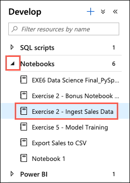

3. Attach your Spark Compute by selecting it from the **Attach to** drop-down list.

   

4. Ensure **Spark (Scala)** is selected in the Language drop-down list.

   

5. At the bottom left corner of the open notebook, select **Configure session**.

   

6. In the Configure session dialog, enter the following:

   - **Executors**: Enter 3.
   - **Executor size**: Select Medium (8 vCPU, 56GB memory).

   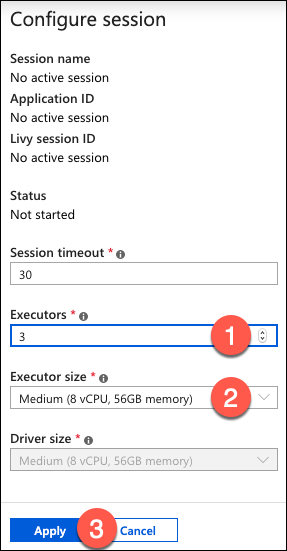

7. Select **Apply** in the Configure session dialog.

8. Publish the notebook to save the changes by selecting **Publish** on the notebook toolbar.

   

9. Select **Run all** from the notebook toolbar to execute each cell within the notebook.

   

10. While the notebook is running, let's take a look at what each cell is doing.

    - **Cell 1** sets the required configuration to connect to an Azure Blob Storage account. A shared access signature or [SAS token](https://docs.microsoft.com/azure/storage/common/storage-sas-overview) is used to grant limited access to the storage account. The SAS token specified restricts the notebook to only read and list actions on blob storage container.

    

    - **Cell 2** loads data from CSV files in the Blob Storage account into a DataSet. Note the `option` parameters indicate that the first row of the files containers the column headers and that we want Spark to infer the schema of the files based on an analysis of the contents of each column. Finally, we display the first five records of the data retrieved and print the inferred schema to the screen.

    

    - **Cell 3** writes the data retrieve from Blob Storage into a staging table in Azure Synapse Analytics using the SQL Analytics connector.

    

11. When Cell 2 finishes running, take a moment to review the associated output.

    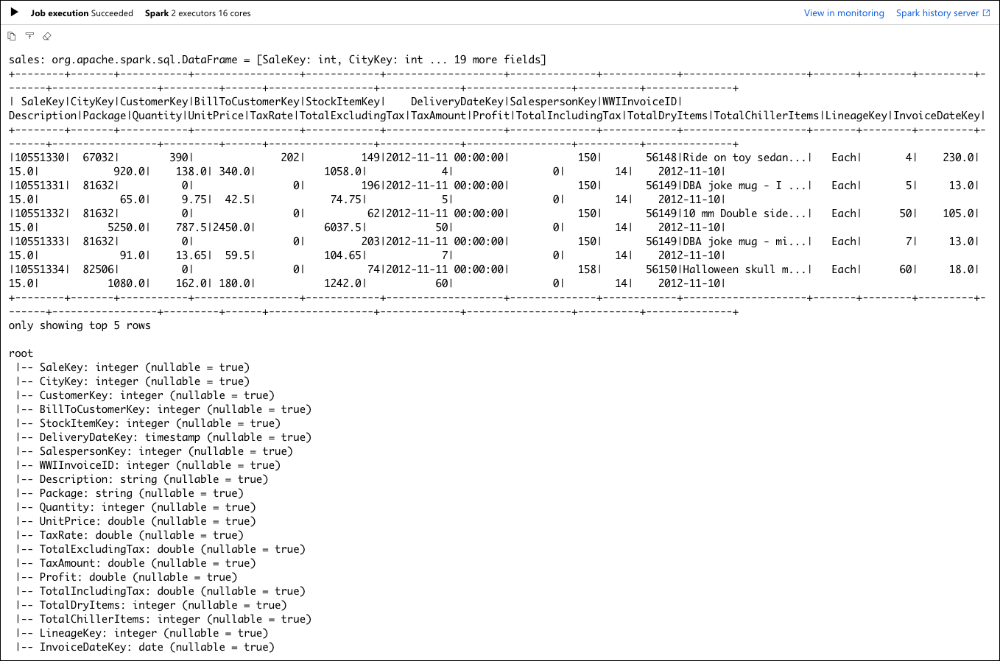

    > The output of Cell 2 provides some insight into the structure of the data and the data types that have been inferred. The `show(5)` command results in the first five rows of the data read being output, allowing you to see the columns and a sample of data contained within each. The `printSchema()` command outputs a list of columns and their inferred types.

12. Next scroll down to Cell 3 and select the arrow icon below the cell to expand the details for the Spark job.

    

    > This pane allows you to monitor the underlying Spark jobs, and observe the status of each. As you can see, Cell 3 is split into two Spark jobs and the progress of each can be observed. We will take a deeper look at monitoring Spark applications in Task 4 below.

13. When the execution of Cell 3 completes, select **Data** from the left-hand menu.

    

14. Expand **Databases** and then expand the **SQLPool01** database.

    

15. Expand **Tables** and locate the table named `staging.WwiSalesData`.

    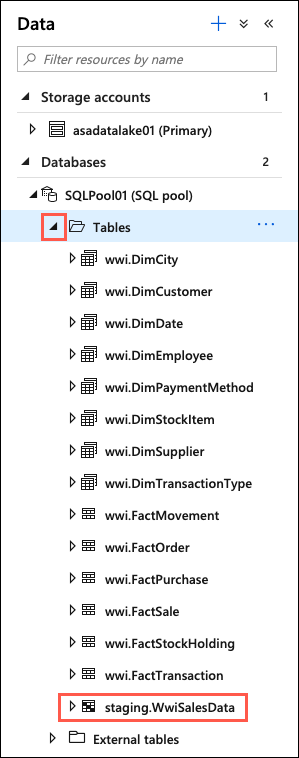

16. To the right of the `staging.WwiSalesData` table, select the Actions ellipsis.

    

17. In the Actions menu, select **New SQL script > Select TOP 1000 rows**.

    

18. Observe the results in the output pane, and see how easy it was to use Spark notebooks to write data from Blob Storage into Azure Synapse Analytics.

### Bonus Challenge

Now, take some time to review the **Exercise 2 - Bonus Notebook with CSharp** notebook. This notebook demonstrates how easy it is create and run notebooks using C# for Spark. The notebook shows the code for retrieving data from Azure Blob Storage and writing that into a staging table in Azure Synapse Analytics using a JDBC connection.

You can run each cell in this notebook and observe the output. Be aware, however, that writing data into a staging table in Azure Synapse Analytics with this notebook takes a long time, so you don't need to wait on the notebook to finish before attempting to query the `staging.WwiSalesDataCSharp` table to observe the data being written or to move on to the next task.

Running the following query every 5-10 seconds allows you to observe the count of records in the table, and how it changes as new records are being added by the notebook.

TODO: Type of more instructions around how to run this query.

```sql
SELECT COUNT(*) FROM [staging].[WwiSalesDataCSharp]
```

## Task 2 - Explore, modify, and run a Data Flow

In this task, you use a Pipeline containing a Data Flow to explore, transform and load data into an Azure Synapse Analytics table. Using pipelines and data flows allows you to perform data ingestion and transformations, similar to what you did in Task 1, but without having to write any code.

1. In Synapse Analytics Studio, select **Orchestrate** from the left-hand menu.

   

2. In the Orchestrate menu, expand **Pipelines** and select the pipeline named **Exercise 2 - Enrich Data**.

   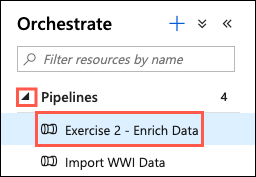

3. Selecting a pipeline opens the design interface for that pipeline, which is where you can review and edit the pipeline using a code-free, graphical interface. This view shows the various activities within the pipeline and the links and relationships between those activities.

   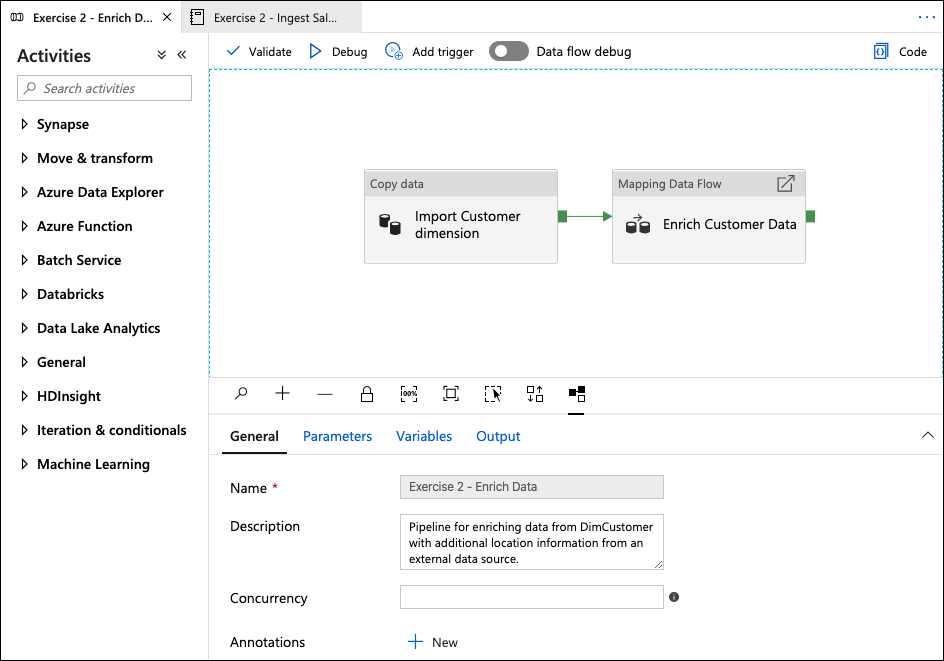

4. Now, let's take a closer look at the activities within the pipeline. In the designer, select the **Copy data** activity named `Import Customer dimension`.

   

5. Below the graphical designer, you will see a series of tabs, each of which provides additional details about the activity. The **General** tab displays the name and description assigned to the activity, along with a few other properties.

6. Select the **Source** tab.

   

7. Select the **Sink** tab.

   

8. Select the **Mapping** tab.

   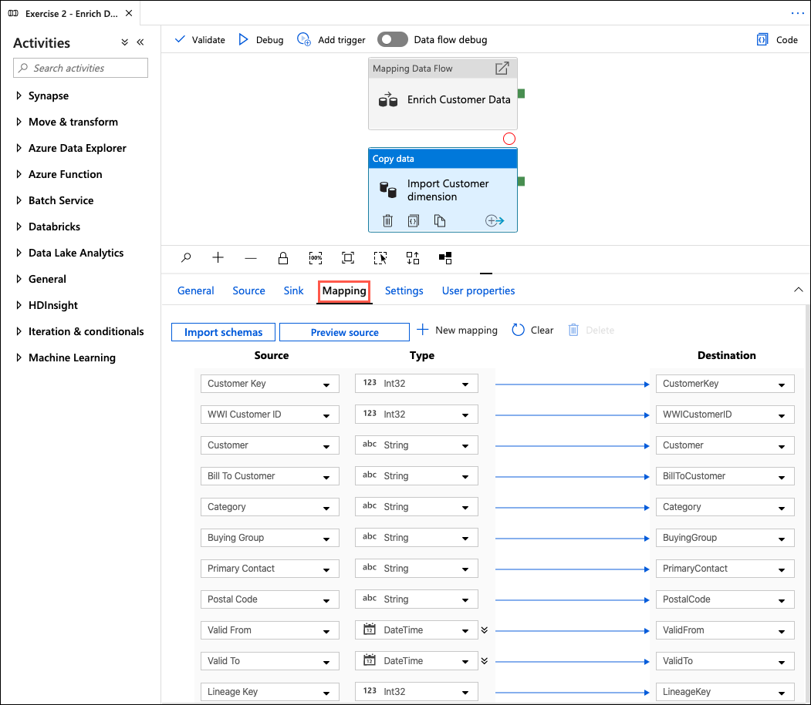

9. Now, let's take a look at the **Mapping Data Flow** activity. Select it in the designer.

   

10. Select the **Settings** tab.

    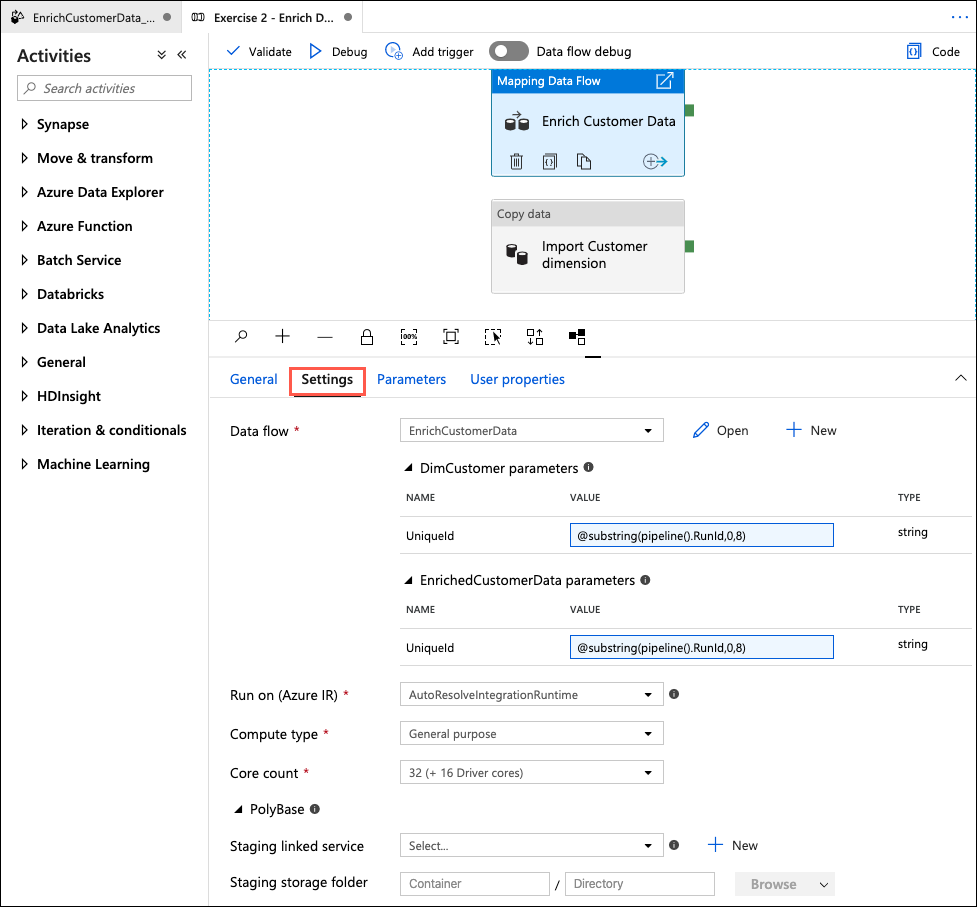

11. The properties on the tabs within the pipeline define the behavior of the data flow within the pipeline. Let's take a look at the actual data flow. Double-click the **Mapping Data Flow** activity in the designer to open the Data Flow in a new tab.

    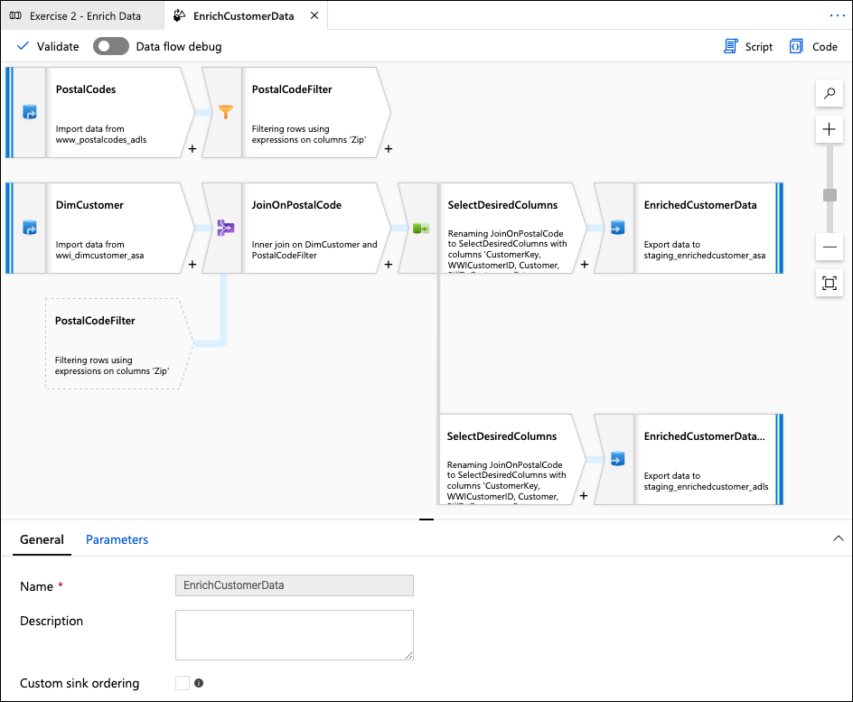

12. In this view, you can see each component of the data flow in more detail.

13. From a high level, the `PostalCodes` and `DimCustomer` components on the left are data sources used to ingest data into the data flow. The `EnrichedCustomerData` and `EnrichedCustomerDataAdls` components on the right are sinks, used to write data to data stores. The remaining components between the sources and sinks are transformation steps, which are can perform filtering, joins, select, and other transformational actions on the ingested data.

    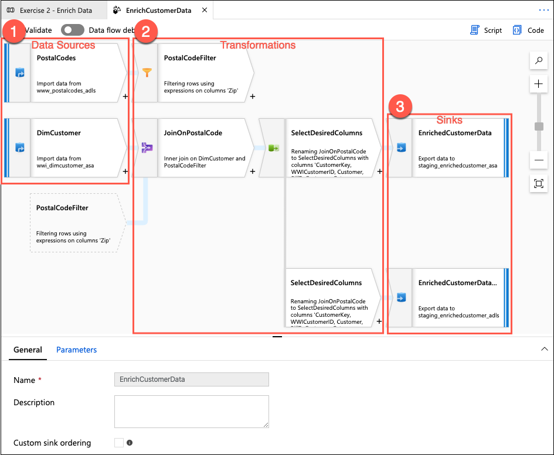

## Task 3 - Monitor pipelines

After you finish building and debugging your data flow and its associated pipeline, you will want to be able to monitor execution of the pipeline and all of the activities contained within it, including the Data Flow activity. In this task, you review the pipeline monitoring functionality in Azure Synapse Analytics.

TODO: Use this article as a reference for the language and steps.
<https://docs.microsoft.com/en-us/azure/data-factory/concepts-data-flow-monitoring>

1. Select **Monitor** from the left-hand menu.

   

2. Under Orchestration, select **Pipeline runs**.

   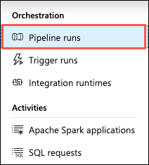

3. Select the top `Exercise 2 - Enrich Data` pipeline run from the list. This will have a status of `In progress`.

   

4. On the pipeline run details screen, you will see a graphical representation of the activities within the pipeline, as well as a list of the individual activity runs.

   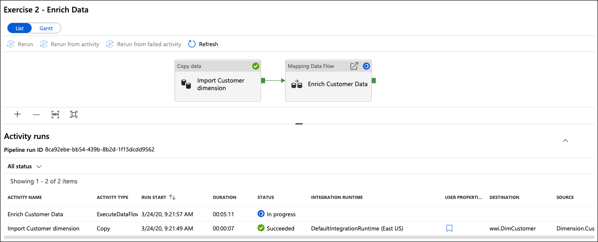

5. TODO: Copy activity monitoring

   

   

   

   

6. TODO: Data Flow monitoring

   

   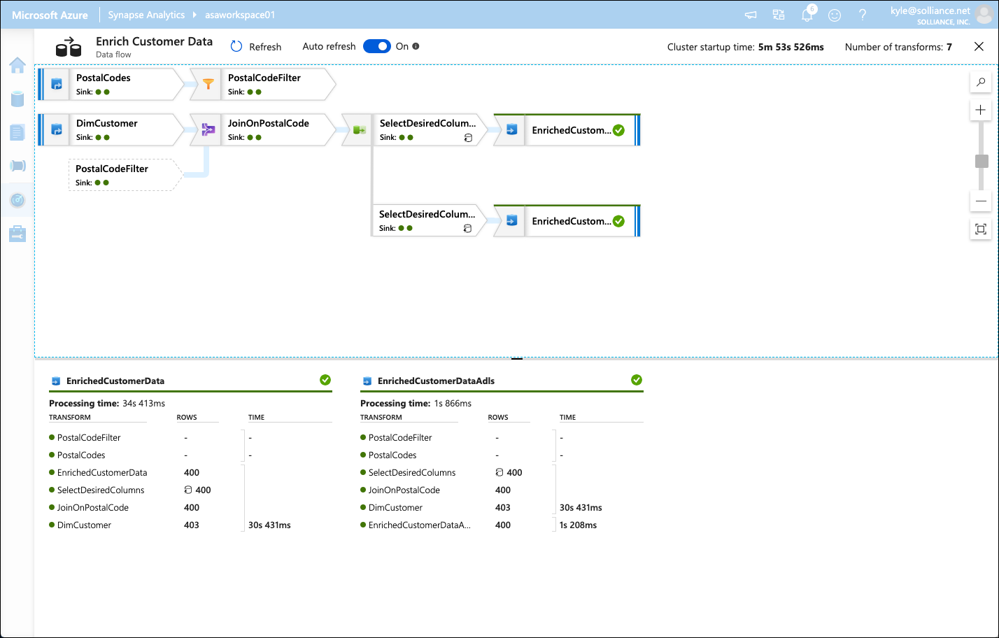

   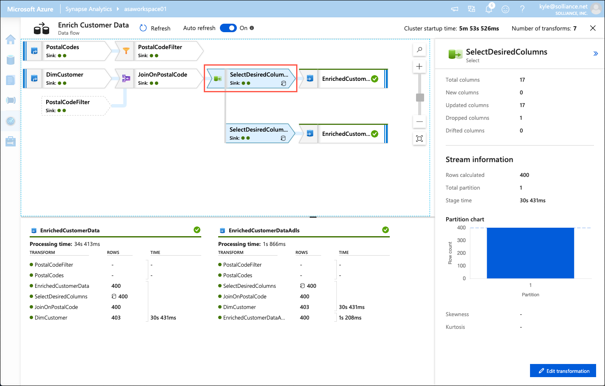

   

7. When the pipeline execution completes, all activities runs will reflect a status of Succeeded.

   

8. Switching to the Gantt view, provides a graphical representation of the run times of the various activities within the pipeline.

   

## Task 4 - Monitor Spark applications

In this task, you examine the Apache Spark application monitoring capabilities built into Azure Synapse Analytics. The Spark application monitoring screens provides a view into the logs for the Spark application, including a graphical view of those logs.

1. As you did in the previous task, select **Monitor** from the left-hand menu.

   

2. Next, select **Apache Spark applications** under Activities.

   

3. On the Apache Spark applications page, select the **Submit time** value and observe the available options for limiting the time range for Spark applications that are displayed in the list. In this case, you are looking at the current run, so ensure **Last 24 hours** is selected and then select **OK**.

   

4. From the list of Spark applications, select the first job, which should have a status of `In progress`.

   TODO: Check on this status, as it should really be Complete or Success, but doesn't seem to update correctly.

   

5. On the **Log query** screen, you will see a detailed view of the job, broken into three different sections.

   - The first section is a graphical representation of the stages that make up the Spark application.
   - The second section is a summary of the Spark application.
   - The third section displays the logs associated with the Spark application.

   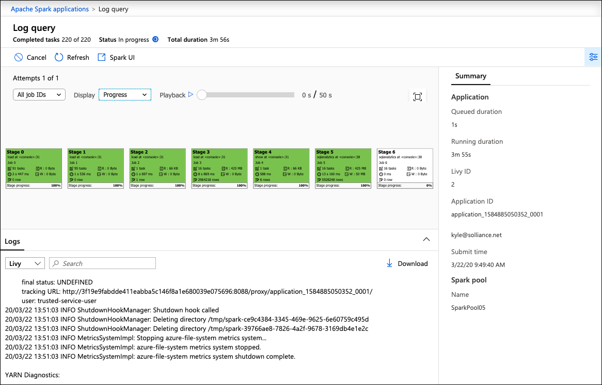

6. In the graph section, the initial graph displayed is that of the overall job progress. Here, you can see the progress of each stage.

   

7. Selecting any individual stage from the graph opens a new browser window showing the selected stage in the Spark UI, where you can dive even deeper into the tasks that make up each stage. Select **Stage 5** and observe the information displayed in Spark UI.

   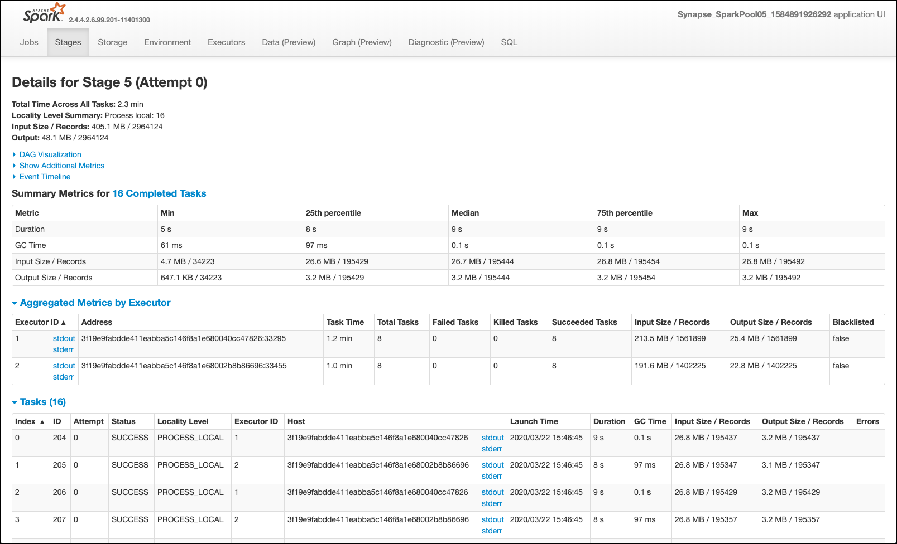

8. Return to the Synapse Analytics Monitoring page for your Spark application.

9. To look closer at any individual stage, you can use the **Job IDs** drop-down to select the stage number. In this case, select the drop-down and choose **5** from the list.

   

10. This view isolates the specific stage within the graphical view.

    

11. Return the view to all stages by selecting **All job IDs** in the job ID drop-down list.

    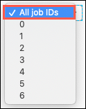

12. Within the graph section, you also have the ability to **Playback** the Spark application.

    

    > **Note**: Playback functionality is not available until the job status changes out of the `In progress` status. The job's status will remain listed as `In progress` until the underlying Spark resources are cleaned up by Azure Synapse Analytics, which can take some time.

13. Running a Playback allows you to observe the time required to complete each stage, as well as review the rows read or written as the job progresses.

    

14. You can also preform a playback on an individual stage. Returning to a view of only Stage 5, the **Playback** button shows the rows written at this stage, along with the progress of reads and writes.

    

15. You can also change the view to see which stages were involved in read and write activities. In the **Display** drop-down, select **Read**.

    

16. In the read graph, stages that involved read tasks are highlighted in orange.

    

17. Next, select **Written** from the Display drop-down list, and observe the stages where data was written.

    
