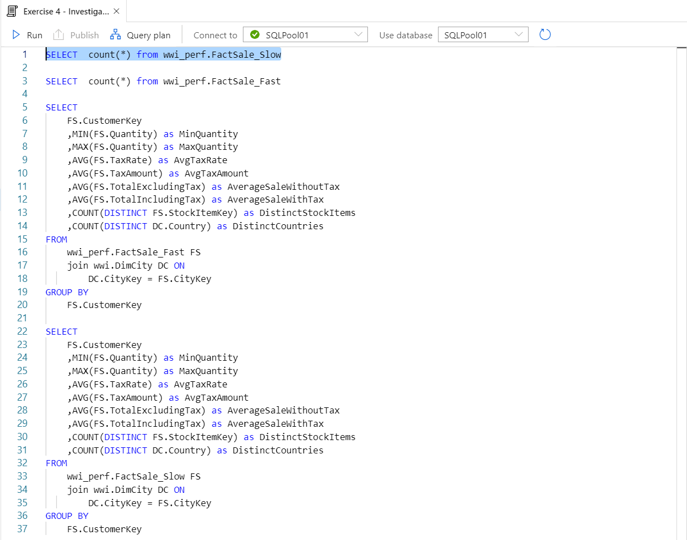
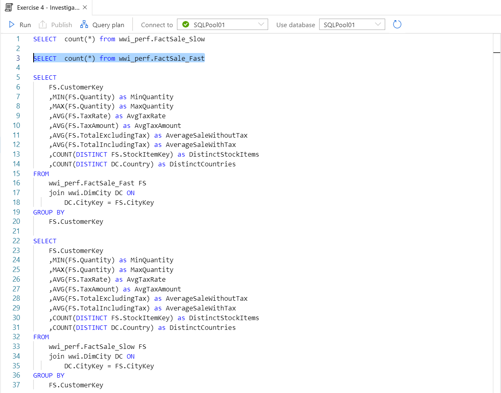
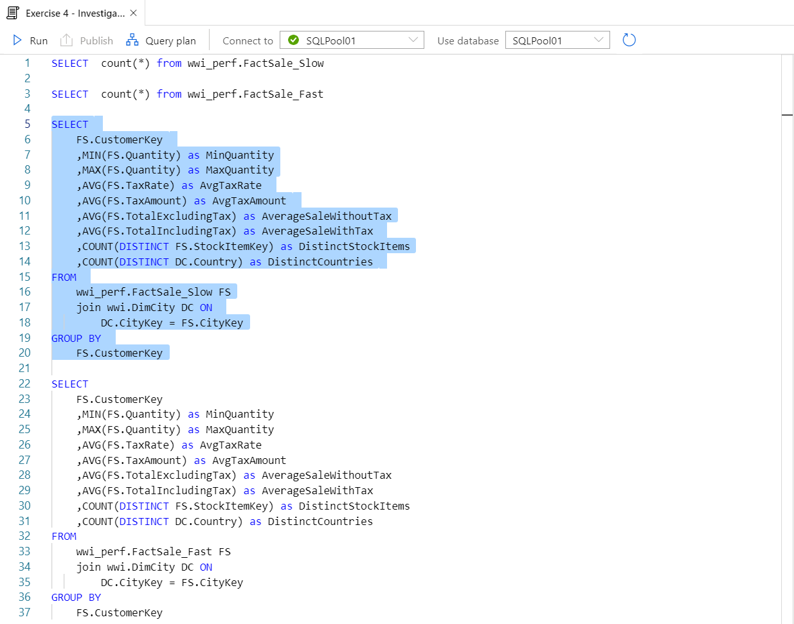
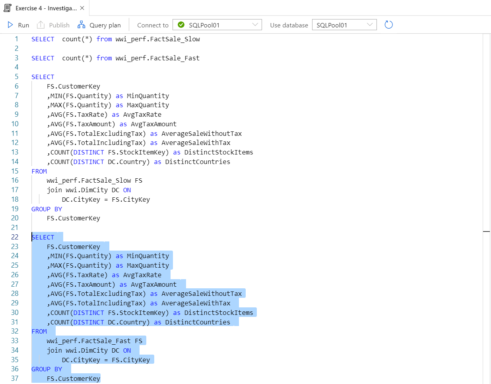
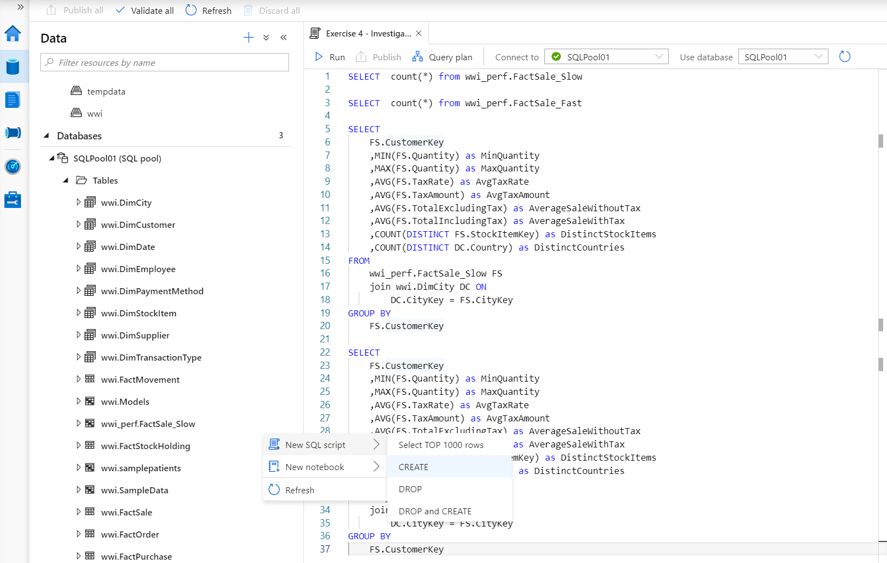

# Exercise 4 - High Performance Analysis with SQL Analytics pool

In this exercise you will use several of the capabilities associated with SQL Pools to analyze the data.

SQL data warehouses have been for a long time the centers of gravity in data platforms. Modern data warehouses are capable of providing high performance, distributed, and governed workloads, regardless of the data volumes at hand.

The SQL Analytics pool in Azure Synapse Analytics is the new incarnation of the former Azure SQL Data Warehouse. It provides all the modern SQL data warehousing features while benefiting from the advanced integration with all the other Synapse services.

- [Exercise 4 - High Performance Analysis with SQL Analytics pool](#exercise-4---high-performance-analysis-with-sql-analytics-pool)
  - [Task 1 - Use a SQL Analytics pool query to understand a dataset](#task-1---use-a-sql-analytics-pool-query-to-understand-a-dataset)
  - [Task 2 - Investigate query performance and table design](#task-2---investigate-query-performance-and-table-design)

> Note:
> The tasks in this exercise must me run against a SQL pool (as opposed to the ones from exercise 1 which were run against the SQL on-demand pool). Make sure you have a SQL pool selected before running each query:

## Task 1 - Use a SQL Analytics pool query to understand a dataset

In this task you will try to understand who your best customers are.

**Challenge:** Can you author and run a query that will aggregate the total quantity of items purchased by customer and then visualize the result with a chart similar to the following?

Solution:

1. Open Synapse Analytics Studio, and then navigate to the `Develop` hub.
2. Under `SQL scripts`, select the script called `Exercise 4 - Analyze Transactions`.
3. Run the script against the SQL Pool database.
4. When the results appear, for the **View** toggle, select **Chart**.
5. For the Chart type, select `Column`.
6. For the Category column, leave the selection at `(none)`.
7. For the Legend (series) column, select `CustomerKey`.

## Task 2 - Investigate query performance and table design

In this task you will try to understand at a general level the implications of table design. You will run the same set of queries against two different fact tables (`FactSale_Fast` and `FactSale_Slow`). The two fact tables have (with one notable exception) the same structure and contain identical data.

First, let's set the stage by performing the following steps:

1. Open Synapse Analytics Studio, and then navigate to the `Develop` hub.
2. Under SQL scripts, select the script called `Exercise 4 - Investigate query performance`.
3. Select line 1 and then select `Run`.

   

   Notice the quick response time (usually under 1 second) and the result - 83.4 million records.

4. Select line 3 and then select `Run`.

   

   Notice the quick response time (usually under 1 second) and the result - 83.4 million records.

5. Select lines 5 to 20 and then select `Run`.

   

   Re-run the query 3 to 5 times until the execution time stabilizes (usually, the first "cold" execution takes longer than subsequent ones which benefit from the initialization of various internal data and communications buffers). Make a note on the amount of time needed to run the query (typically 5 to 15 seconds).

6. Select lines 22 to 37 and then select `Run`.

   

   Re-run the query 3 to 5 times until the execution time stabilizes (usually, the first "cold" execution takes longer than subsequent ones which benefit from the initialization of various internal data and communications buffers). Make a note on the amount of time needed to run the query (typically 1 to 3 seconds).

**Challenge**: Can you explain the significant difference in performance between the two seemingly identical tables? Further more, can you explain why the first set of queries (the simple counts) were not that further apart in execution times?

Solution:

1. In Synapse Analytics Studio, navigate to the `Data` hub.
2. Under Databases, expand the SQL pool node (the one that has its name ending in `(SQL pool)`), expand `Tables`, and locate the `wwi_perf.FactSale_Slow` table.
3. Right click the table and then select `New SQL script`, `CREATE`.

   

4. In the CREATE script, note the `DISTRIBUTION = ROUND_ROBIN` option used to distribute the table.

5. Repeat the same actions for the `wwi_perf.FactSale_Fast` table and note the `DISTRIBUTION = HASH ( [CustomerKey] )` option used to distribute the table.

This is the key difference that has such a significant impact on the performance of the last two queries. Because `wwi_perf.FactSale_Slow` is distributed in a round robin fashion, each customer's data will end up living in multiple (if not all) distributions. When our query needs to consolidate each customer's data, a lot of data movement will occur between the distributions. This is what slows down the query significantly.

On the other hand, `wwi_perf.FactSale_Perf` is distributed using the hash of the customer identifier. This means that each customer's data will end up living in a single distribution. When the query needs to consolidate each customer's data, there is essentially not data movement occurring between distributions which makes the query very fast.

Finally, the reason why the first two queries (the counts) where not that far apart performance-wise is because none of them incurred any data movement (each distribution just reported it's local counts and then the results were aggregated).

This simple example demonstrates one of the core challenges of modern, massively distributed data platforms - solid design. You witnessed first-hand how one decision taken at table design time can have a significant influence on the performance of queries. You also got a glimpse of Azure Synapse Analytics's raw power: the more efficient table design enabled a non-trivial query involving more than 80 million records to execute in just a few seconds.
